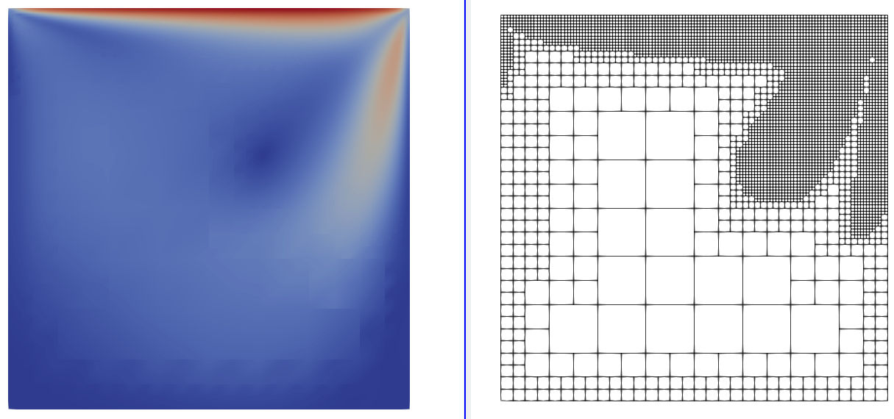
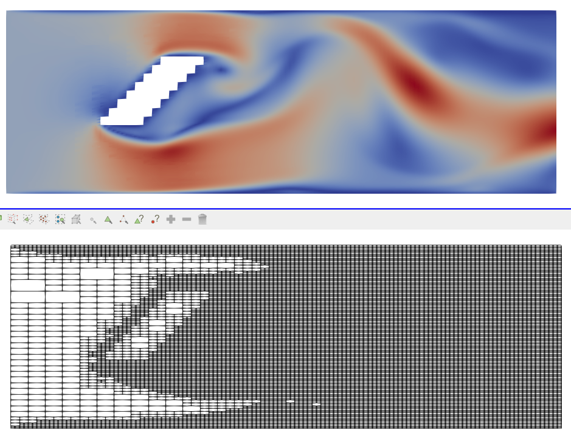

[[TOC]]

# Introduction

This project is an extension to the Fluidchen framework that provides it with Adaptive Mesh Refinement (AMR) capabilities.

This project should be viewed as a proof of concept and reference implementation
rather than a standalone project given its lack of maturity and limitations.

## Software Requirements

Due to the extended use of templates in some of the new components as well as
other modern features, the C++ standard has been updated from C++20 to C++23,
although all of the newer features used are widely available in all recent
versions of the major compilers.

The current version has only been tested with GCC, and there are some GCC
specific flags in the `cmake` configuration, but no GCC specific features have
been used in the code.

## Building the code

```shell
git https://gitlab.lrz.de/00000000014BECEA/cfdlab-group-e.git
cd cfdlab-group-e
mkdir build && cd build
cmake [-DCMAKE_BUILD_TYPE={Debug,Release}] [-DENABLE_SANITIZERS={ON, OFF}] ..
make
```

After `make` completes successfully, you will get an executable `fluidchen` in your `build` directory. Run the code from this directory.

### Build options

`CMAKE_BUILD_TYPE` and `ENABLE_SANITIZERS` are two optional `cmake` flags that
allow building the project in debug or release mode and with or without
sanitizers enabled respectively.

By default, the project is built in release mode with no sanitizers.

The project is built automatically on every `push` to the remote repository in
order to monitor updates for breaking changes.

## Running

In order to run **Fluidchen**, the case file should be given as input parameter. Some default case files are located in the `example_cases` directory. Navigate to the `build/` directory and run:

### Sequential execution
```shell
./fluidchen ../example_cases/{example}/{example}.dat
```

### Parallel execution with MPI

Parallel execution with MPI is no longer supported.

## Implementation

We will briefly comment on the major implementation changes that have been made
with respect to the original framework.

### Tree as the underlying container

Adaptive Mesh Refinement inherently leads to a non-isotropic discretization of
space, which no longer fits into a matrix-like data structure. 
A quad tree, a hierarchical tree data structure, has been developed as the backbone component to the new algorithm. 
Our particular implementation only stores leaf nodes.

The quantities of interest of the fluid cells in the discretized domain are
stored in multiple underlying buffers (one per QOI).
These buffers are sorted
in such a way that spatial locality in the domain tends to be preserved in this
buffers.
This is achieved by using an index that represents a space filling curve over the
domain.
Further discussion about this index, referred to as the Node Index, can be found in the next section.

A hash table maps node indices into the underlying buffers such that values can
be retrieved.

### Node Index

The node index is a key component in the algorithm and serves two main purposes.

First of all, it relates nodes in the tree in a hierarchical manner, such that
indices of parents, children, neighbours, etc, can be obtained.
This is essential in stencil computation and for the correct internal logic of
the tree.

Secondly, the index represents a space filling curve that allows sorting the
underlying buffers to improve data locality by using spatial locality
information of the grid.

A Morton index, which is based on a Z-shape space filling curve, has been used as a node index implementation.

### Cell-Centered Grid

The previously used staggered grid has been replaced in favor of the simpler
cell-centered grid to simplify tree logic, specifically regarding finding neighbouring cell values and boundary conditions.

Stability of the numerical solutions has thus been a concern, and we could indeed observe some form of checkerboard oscialltions in badly composed examples (for example initial grid resolution too low). 
However, in well defined examples, we do not observe any major instabilities and, perhaps, the donor cell scheme effectively damps higher order frequencies. 

The use of the cell-centered grid allows the tree to contain exactly one value for each QOI
per cell.

### Boundaries

Non-fluid cells impose restrictions of the amount of refinement that can be
done, since the mesh needs to adequately represent them.

In order to support arbitrary geometries, internal boundaries are contained in
the tree, and impose a minimum refinement locally. To overcome this issue on the
outer boundaries, these are always computed on demand by callbacks.
Similarly, values of inner boundaries are also computed on demand by callbacks,
even if the tree contains these cells, it is only for internal logic, and their
values are never used.

The boundaries types are now provided by the input files.
Neumann and Dirichlet boundary conditions are supported.

## Initialisation

For the initalization of the tree, the code reads the pgm file which was updated to be a binary matrix (0 : fluid; 1: obstacle). The boundaries were extracted from the pgm file and are now specified in the input file. Also, the pgm file needs to be a square with power of 2 elements in both directions to fit in a tree. Internally, the tree will automatically adapt to the pgm file and will be initialized with at least the mininum initial refinement defined by the user and will potentially be further refined to fit the geometry of obstacles.


## Refinement/Coarsening Condition
The refinement and coarsenign condition used is based on the vorticity. In the input file the user can define the lower threshold of the vorticity below which cells get flagged as coarsen and also the upper threshold above which cells get refined.


## Performance

In terms of performance we observe that our implementation cannot compete with the matrix based implementation we had before.
Thus, even if we where to use the same isotropic grid in both cases, we observe that the AMR version is significantly slower.
We want to briefly discuss a few reason we identify for this behaviour.

- Small scale examples: AMR makes sense for large scale problems where there are big enough to contain processes happening at multiple spatial and time scales in different regions.
The examples we run are small enough for this not to be a concern.
Additionally, to preserve some regularity in the grid, which is crucial for stability, we effectively only have 2-4 different level of refinements we can actually use for the AMR, which massively limits its potential.

- Redundant computation of neighbors: Looking up the neighbors in an isotropic grid is trivial and extremely cache friendly.
In an AMR scenario, finding neighbours has a non trivial cost since it requries
multiple indirections and involves several steps and case distinctions.
This includes computing the Morton index of neighbors, case distinction for neighbor on a different level, hash table lookups, and potential interpolation.
Precomputing the neighbour linear index would be the first optimization to implement.
This would not remove the interpolation, but would solve almost all other issues.
This is clearly the main bottleneck of our code, which is also confirmed by profiling result showing that the get `neihgbor_value_function` which looks for a neighbor value, manages boundary conditions and interpolation, uses over 40% of the total runtime.
Note that the exact value depends on the example and its configuration.

- A very powerful optimization we have not done is storing a big block of fluid cells in an isotropic grid per tree node (rather than a single cell in the current implementation) and use the regular matrix based approach within this node, and only use the tree for boundary communication between blocks.
This would reduce the precision with which the adaptive mesh adapts to geometries.
This is a well known technique to improve performance performance.

### Performance Numbers

We have measured, from a small set of reference runs, total runtime percentage
of some functions core to the new algorithm:

- Sorting the tree: 0.05%
- Index finding in the hash table: 2.6%
- Interpolation 15%
- Accessing tree values (of one cell or an average from a cell block): 24%
- Accessing neighbor values: 43%

Note that these functions are not disjoint.

## Overview: New Input Parameters

### Boundary Conditions

We support the same 5 boundary conditions as in the old code, each paired with a boundary value (e.g., wall velocity, inflow velocity, wall temperature).  
Specify these for each of the four boundaries (`top`, `bottom`, `left`, `right`) in the input file.


**Supported boundary types:**  
- `no_slip`
- `moving_wall`
- `inlet`
- `outlet`
- `temperature`

Each type uses its corresponding value:
- `moving_wall` → wall velocity
- `inlet` → inflow velocity
- `temperature` → wall temperature


**Lid Driven Cavity Example**
| Boundary      | Type           | Value (example) |
|---------------|---------------|----------------|
| `top_bc_type`    | `moving_wall`  | `top_bc_value` = 1.0 |
| `bottom_bc_type` | `no_slip`      | `bottom_bc_value` = 0.0 |
| `left_bc_type`   | `no_slip`      | `left_bc_value` = 0.0 |
| `right_bc_type`  | `no_slip`      | `right_bc_value` = 0.0 |


---

### AMR Parameters

| Parameter                  | Description                                                        | Example Value |
|----------------------------|--------------------------------------------------------------------|--------------|
| `reconstruction_frequency` | Frequency of adapting the tree to the current simulation solution  | 10           |
| `vorticity_lower_limit`    | Below this, cells are flagged for coarsening                      | 0.01         |
| `vorticity_upper_limit`    | Above this, cells are flagged for refinement                      | 0.1          |
| `initial_min_refinement`   | Minimum initial refinement level of the tree                      | 5            |
| `max_tree_depth`           | Maximum level of refinement (supported up to 10)                  | 8            |

---


### Example Output
Such as in the old version, we implemented a vtk output feature to print the tree with all its QOI to a vtk file. The input files in the example_cases directory lead to the following final states of the simulation.

#### Lid Driven Cavity



*Figure: Velocity Magnitude and grid for final state of Lid Driven Cavity *


#### Channel With Obstacle



*Figure: Velocity Magnitude and grid for final state of Channel With Obstacle *