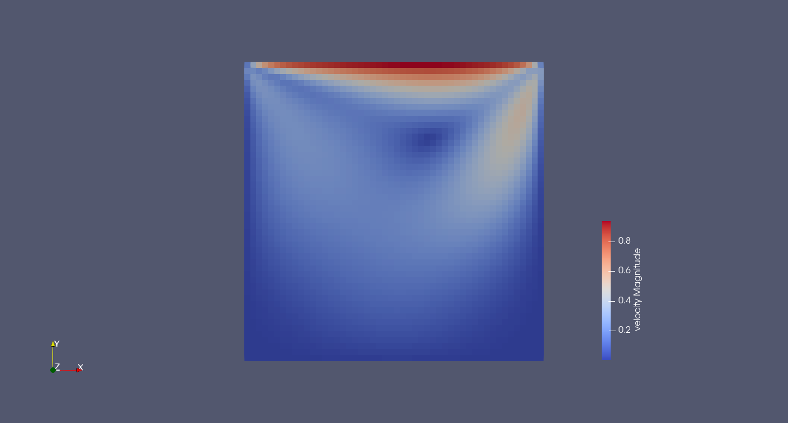
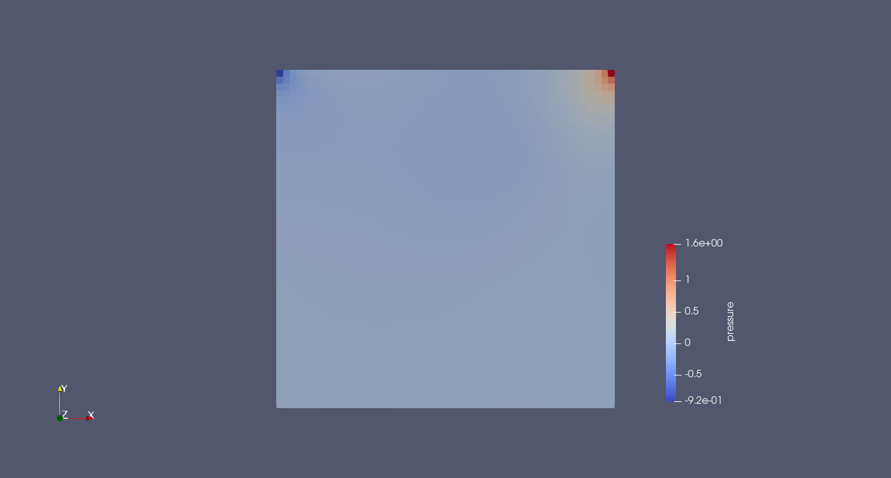
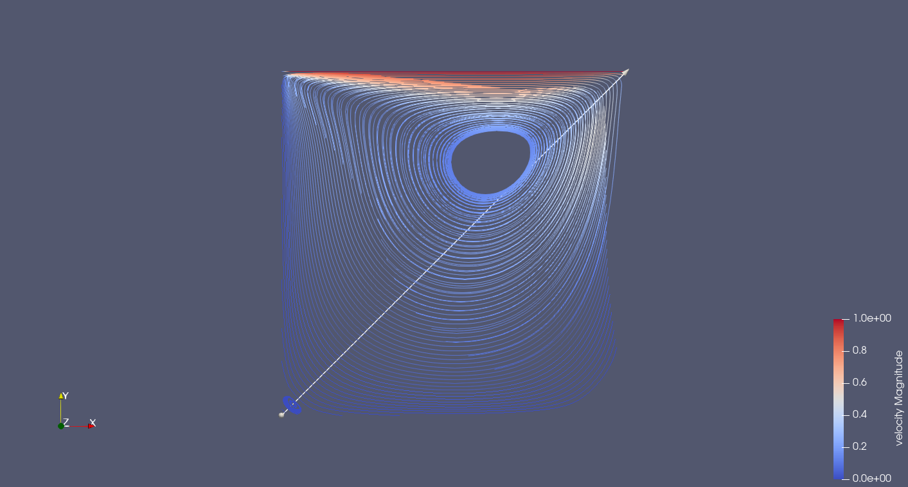
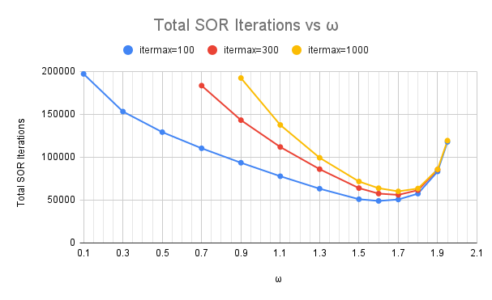
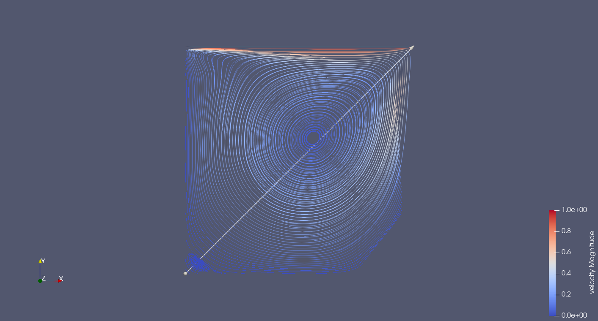
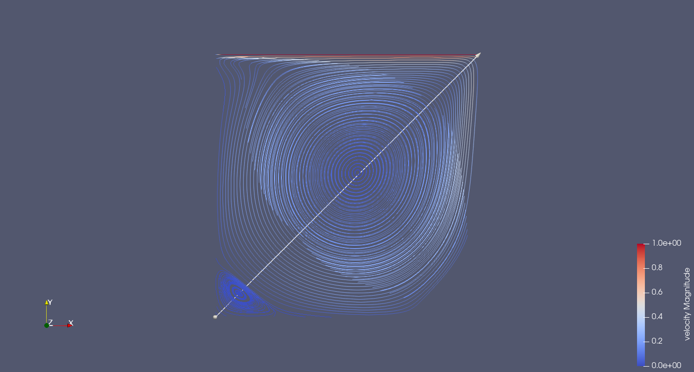
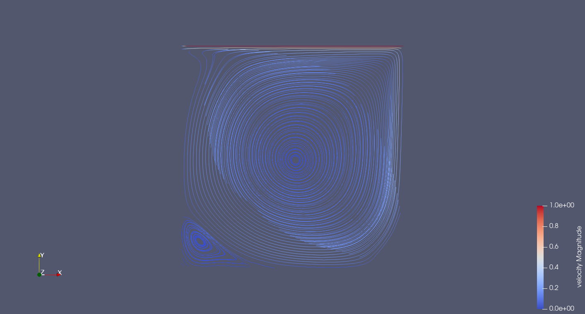

# CFD Lab - Worksheet 1

Authors: Jonas Schupp, Miguel Veganzones, Iñigo Ruiz

Date: 13/05/2025  

Course: CFD Lab   

---

## Overview

This report presents our results for Worksheet 1, which is focused on simulating incompressible, two-dimensional fluid flow using the Navier-Stokes equations, applied to a famous model problem: The lid-driven cavity. The tasks involved understanding the theoretical foundations of the model, implementing a finite-difference discretization on a staggered grid in C++, and solving the pressure Poisson equation using a Successive Over-Relaxation (SOR) method.
The report covers also setting appropriate boundary conditions, analyzing the influence of numerical parameters, and visualizing the results using ParaView.

---

## Problem 3 – Standard Lid Driven Cavity

### Description  
Visualization of the 2D incompressible Navier-Stokes equations for the lid-driven cavity problem

### Parameters  
| Parameter | Value  | Parameter | Value  | Parameter | Value  |
|-----------|--------|-----------|--------|-----------|--------|
| imax      | 50     | jmax      | 50     | xlength   | 1.0    |
| ylength   | 1.0    | dt        | 0.05   | t_end     | 50.0   |
| tau       | 0.5    | dt_value  | 0.5    | eps       | 0.001  |
| omg       | 1.7    | gamma     | 0.5    | itermax   | 100    |
| GX        | 0.0    | GY        | 0.0    | nu        | 0.01   |
| UI        | 0.0    | VI        | 0.0    | PI        | 0.0    |

### Plots

  <figure style="text-align: center; width: 50%;">
    
    <figcaption>Velocity field</figcaption>
  </figure>

  <figure style="text-align: center; width: 50%;">
    
    <figcaption>Pressure field</figcaption>
  </figure>

  <figure style="text-align: center; width: 50%;">
    
    <figcaption>Streamlines</figcaption>
  </figure>

## Problem 5 – SOR Behaviour

### Description  
Analysis of the Successive Over-Relaxation (SOR) solver for $\omega$ in the range  $\omega=[0..2]$ and the influence of `itermax`.

### Observations  
- We found a value of omega of $\omega = 1.6 - 1.7$ to lead to the least amount of SOR total iterations. This can be explained by the fact that small $\omega$ values result in slow convergence due to small updates in each iteration, while values that are too large lead to overcorrections (numerical overshooting), which can also hinder convergence.
- In the first timesteps of the simulation, the SOR solves fails to converge to the specified tolerance
within `itermax=100` iterations. This can be attributed to a poor initial guess at the beginning of the simulation, which is still far from the true solution. Additionally, we observe large gradients in both the velocity and pressure fields during the early timesteps, which make the pressure Poisson equation harder to solve efficiently. As the simulation progresses, the flow becomes smoother, the initial guess improves (by reusing the pressure from the previous timestep), and the number of iterations required for convergence drops significantly. Once the system approaches a steady state, the SOR solver typically converges in only 2 to 3 iterations.
- Therfore, the parameter `itermax` does have an impact in the startup phase, where the solver does not converge in `itermax=100` iterations for the standard parameters (see Problem 3). Thus, for higher `itermax` the results for the startup phase are a bit more precise, while after the simulation has settled the effect of `itermax` is neglible, as the solver converges in few iterations. 
- In particular, for low values of $\omega$, which make the solver tend to converge slower, a higher values for `itermax` (f.e. 300 or 1000) improve the accuracy in the first steps.

### Results

The default simulation parameters have been used to evaluate the effect of omega
on the convergence rate of the SOR solver by looking at the total number of
iterations throughout a complete run. These parameters can be found in "./example_cases/default.dat".

  <figure style="text-align: center; width: 50%;">
    
    <figcaption>Total SOR Iterations vs. omega</figcaption>
  </figure>

---

## Problem 6 – Impact of Δt

### Description  
In this part we aim to study the influence of different time step sizes on stability. Therefore, we switch off the adaptive timestepping and run the simulation for the following set of fixed timesteps:
- Δt = [0.05, 0.04, 0.03, 0.02, 0.015 , 0.01, 0.009, 0.008, 0.007, 0.006, 0.005]

### Observations / Results
The following table shows the stability we evaluated for the different timesteps:
| Δt      | 0.05 | 0.04 | 0.03 | 0.02 | 0.015 | 0.01 | 0.009 | 0.008 | 0.007 | 0.006 | 0.005 |
|---------|------|------|------|------|-------|------|--------|--------|--------|--------|--------|
| Stable  |      |      |      |      |       |      |   x    |   x    |   x    |   x    |   x    |

The results align with the conditions defined in the adaptative timestepping. We found out that for the standard Lid-driven Cavity parameters the condition relating timestep, grid size and viscosity (lim1 in our code) dominates the adaptive time stepping. This formula returns for the standard parameters:
$$
 \Delta t < \frac{1}{2*\nu} \cdot \frac{\Delta x^2 \cdot \Delta y^2}{\Delta x^2 + \Delta y^2} = 0.01
$$

---

## Problem 7 – Influence of `imax` and `jmax`

### Description  
Investigation of grid resolution effects on convergence and computational cost.

### Parameters
- imax = jmax = `16`, `32`, `64`,`128`, `256`
- nu = 0.001
- dt = 0.05

### Experiments

| Grid Size | Convergence | Notes                                     | Max RSS (kB) | Execution Time |
|-----------|-------------|-------------------------------------------|--------------|----------------|
| 16×16     | Yes         | —                                         | 32,684       | 0.72 s         |
| 32×32     | Yes         | —                                         | 32,884       | 2.42 s         |
| 64×64     | No          | Residual explodes during first iteratons  | 33,512       | 14.21 s        |
| 128×128   | No          | Residual explodes during first iterations | 34,444       | 57.92 s        |

### Observations  
- The grid resolution is involved in all three equations of the adaptive time stepping. In particular, the CFL conditions should be mentioned as they directly relate the grid resolution via the maximum velocity to the required timestep for a stable simulation. The viscosity-related condition, which couples the grid spacing with the kinematic viscosity and timestep, also plays a decisive role in determining stable configurations.
- Generally, for all other parameters held constant, finer grids (higher resolution) require smaller timesteps to maintain stability. Conversely, coarse grids can tolerate larger timesteps but at the expense of spatial accuracy.
- For the particular set of parameters used, this stability is achieved at a grid
size of $32\times32$ or lower.

One of the stability conditions that relate the time step and the grid size is:
$$
2 \nu  dt < \frac{(\delta x)^2(\delta y)^2}{(\delta x)^2 + (\delta y)^2}
$$

For this particular set of parameters we have a threshold of
$$
2 * \nu * dt = 0.0001 \\
$$

Evaluating this condition for each of the grid sizes we obtain:
$$
lim_{16\times16} = 0.001953 \\
lim_{32\times 32} = 0.000488 \\
lim_{64\times 64} = 0.000122 \\
lim_{128\times 128} = 0.000031
$$

Comparing these results we can see that the $128 \times 128$ case does not meet
the stability condition, while all other resolutions do.

For the CFL conditions we assume a maximum velocity of `u_max = v_max = 1` for the lid-driven cavity, as it would be unphysical to have higher velocities than the moving wall in this setup.
The CFL conditions yield:
$$
\Delta x = \Delta y > \Delta t \cdot v_{\text{max}} = 0.05 \quad \Rightarrow \quad i_{\text{max}} = j_{\text{max}} = \frac{1}{\Delta x} < \frac{1}{0.05} = 20
$$
Our results show that even tough the resolution 32x32 violates the CFL condition, it stills leads to a stable simulation. 

---

## Problem 8 – Influence of Viscosity

### Description  
In this section we look at the effect of changing viscosity on flow behavior.

### Tested viscosities  
- $\nu$ = `0.01`, `0.002`, `0.0005`,`0.0001`

### Observations  
We observed different flow behaviors for different viscosities in the lid-driven cavity problem. In general, lower viscosities (i.e., higher Reynolds numbers) lead to a more centralized primary vortex with stronger secondary vortices forming near the corners. In contrast, higher viscosities (lower Reynolds numbers) result in a smoother, more diffusive flow where the primary vortex remains closer to the moving lid and the corner eddies are significantly weaker or absent.

Stream Trace for different velocities:

  <figure style="text-align: center;">
    
    <figcaption>Viscosity ν = 0.01</figcaption> 
  </figure>
  <figure style="text-align: center;">
    
    <figcaption>Viscosity ν = 0.002</figcaption>
  </figure>

  <figure style="text-align: center;">
    
    <figcaption>Viscosity ν = 0.0005</figcaption>
  </figure>
  <figure style="text-align: center;">
    
    <figcaption>Viscosity ν = 0.0001</figcaption>
  </figure>

---

## Notes & Further Questions

- One point we were quite confused of is the treatment of the corner cells. First, we do not fully understand the assignment of corner cells in the assign_cell_types() function of the Grid class. For example, for the bottom left corner (i = 0, j = 0) there are two if statements checking if its rigth/top neighbor are fluid cells. As they are not Fluid cells all of these if statements never get triggered and no borders are assigned to the corner cells, if we see it correctly. Why do we still have them ? Furthermore, we were a bit unsure whether the values of the corner cells would have an impact on our simulation and if we should separately treat them. In particular we thought about the convection terms, for which we were not entirely sure, if they would touch the corners at some point. Is this something we need to keep in mind and handle separately ?

