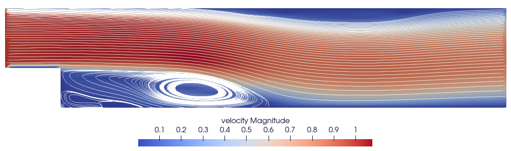
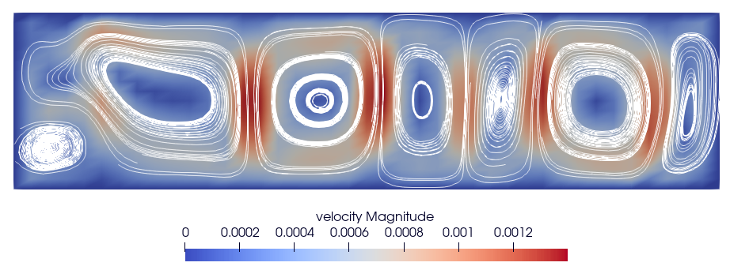

# CFD Lab - Worksheet 2

Authors: Jonas Schupp, Miguel Veganzones, Iñigo Ruiz

Date: June 2nd

Course: CFD Lab   

---

## Table of Contents
In this report we want to present some documentation of our implementation extension for worksheet 2. We will also present our results for the example cases. Furthermore we will discuss the performance impact of the fundamental changes we implemented, also concerning the API:

1. [Worksheet 2 Examples](#1-worksheet-2-examples)
    1. [Plane Shear Flow](#plane-shear-flow)
    2. [Channel with Obstacle](#channel-with-obstacle)
    3. [Channel with BFS](#channel-with-bfs)
    4. [Natural Convection](#natural-convection)
    5. [Fluid Trap](#fluid-trap)
    6. [Rayleigh-Benard Convection](#rayleigh-benard-convection)
2. [Further Remarks regarding our Implementation](#2-implementation-remarks)
3. [Performance Analysis](#3-performance-analysis)

## 1. Worksheet 2 Examples
In general, we noticed a couple of discrepancies between the input parameters given in the worksheet and the `.dat` config files provided on Moodle.
For consistency we decided to fully stick with the input parameters given in the worksheet and, therefore, changed the `.dat` files accordingly.
Furthermore, we generally observed that our result qualitatively align with the example output provided as reference.
However, for some of the examples we noticed some minor quantitative differences, which we assume to be caused by slightly different input values or potentially minor differences in the implementation.

### Plane Shear Flow
Plane shear flow offers a valuable opportunity to validate our implementation, as an analytical solution is available for comparison. In the following, we will examine our numerical results and compare them to the analytical solution.

Due to the combination of boundary and initial conditions, the simulation exhibits relatively high gradients during the first few time steps. These early steps therefore require many SOR iterations. However, after the initial disturbance, the simulation stabilizes and converges to the expected velocity distribution.

A deviation in the velocity field near the inlet is noticeable when compared to the rest of the flow. This phenomenon arises from the uniform inflow boundary condition (Dirichlet for the velocity) interacting with the no-slip boundary conditions at the top and bottom walls. Nevertheless, this deviation quickly fades, and a parabolic velocity distribution emerges throughout the rest of the domain.


*Figure: Stationary velocity field*


#### Comparison with Analytical solution

To compute the analytical solution, we need the negative pressure gradient in x-direction. By plotting the pressure along the x-axis at $y = 1$ , we observe that, after an initial disturbance near the inlet, the pressure gradient stabilizes at a constant value of 0.3.
The deviation from the linear behaviour for the pressure gradient near the inlet can be explained by the zero Neumann Boudary condition for the pressure at the inlet, which forces the pressure to be constant in x at the inlet.


*Figure 1: Pressure in $x$ at $y = 1$*

With this information, we can now compute the analytical solution.
The Reynolds number is computed from the flow velocity, a characteristic length, and the kinematic viscosity:

$$
\mathrm{Re} = \frac{U \cdot L}{\nu} = \frac{1 \cdot 1}{0.1} = 10
$$

Now, the analytical velocity profile is given by:

$$
u(y) = -\frac{1}{2} \cdot \mathrm{Re} \cdot \frac{\Delta p}{\Delta x} \cdot y \cdot (y - h)
$$

Plugging in the values $\mathrm{Re} = 10$ , $\frac{\Delta p}{\Delta x} = 0.3$ , and $h = 2$:

$$
u(y) = -\frac{1}{2} \cdot 10 \cdot 0.3 \cdot y \cdot (y - 2) = u(y) = -1.5 \cdot (y^2 - 2y)
$$

We compare this analytical solution with the numerical data extracted at x=10 and observe excellent agreement between the two.
This confirms the correctness of our implementation.


*Figure: Comparison of analytical and numerical solution*


### Channel with Obstacle

In this example, we analyze the behavior of a fluid flowing through a channel that contains an obstacle.
The objective of this simulation is to observe the formation of a phenomenon known as the Kármán vortex street which is a repeating pattern of swirling vortices resulting from the unsteady separation of fluid flow around a non-streamlined body.

In this case, the obstacle is a tilted plane positioned approximately at the center of the channel.


*Figure: Animation showing the development of the Kármán Vortex Street*

The vortex shedding is clearly visible when the simulation is animated.

At the final timestep (t = 30 seconds), the still image reveals the characteristic oscillating vortex pattern. We also observe that the velocity at the cells adjacent to the obstacle is zero, consistent with the no-slip boundary condition.

The pressure distribution shows a low-pressure region forming near the top of the obstacle. This low-pressure zone moves downstream with the flow, and a similar region then appears near the bottom of the obstacle. This alternating pattern continues, indicating a periodic shedding of vortices.


*Figure: Velocity field at 30 sec*


*Figure: Pressure field at 30 sec*


### Channel with BFS

This example analyzes a channel with a backward facing step (BFS), which
produces interesting behaviour from forced fluid velocity through boundary
conditions and a naturally occurring opposite pressure gradient.

The boundary conditions for this example impose a fixed inlet velocity and zero
Neumann pressure at the inlet before the step, while at the output we have fixed
zero pressure and a zero Neumann for the velocity

The step creates a low pressure region right after it, which draws fluid back,
generating a recirculation region where a vortex is generated, followed by a
reattachment region where the primary flow reaches the floor of the channel.

Fluid flow is shown at two time points below.


*Figure: Velocity field at 10 sec*



*Figure: Velocity field at 30 sec*

From the differences we can see that flow takes some time to fully develop.
The recirculation region grows longer as the lowest pressure areas shift
position.
As a result, the reattachment region is also further back into the channel.

The pressure gradient, shown below, was, for us, an unexpected result, since it seems to
oppose fluid flow in what we consider a counter-intuitive way.
We reviewed the first steps of the simulation execution in depth and got to the
conclusion that this is expected behaviour that arises from the combinantion of
boundary conditions.


*Figure: Pressure field at 30 sec*

### Natural Convection

In the previous example problems, we analyzed forced convection, where the fluid was set in motion by either a moving wall or an inlet with defined boundary velocity.
In this case, however, the fluid is initially at rest and all walls have a no-slip boundary condition. Motion arises due to a temperature difference imposed between two opposing walls. This introduces the energy transport equation into the simulation.

When a region of fluid is heated, it becomes less dense and rises due to buoyancy forces. Conversely, cooler fluid becomes denser and sinks. This temperature-driven density variation results in a natural convection flow pattern.

The outcome is a circulatory flow: fluid adjacent to the hot wall rises, while fluid near the cold wall descends, forming a continuous convection loop within the domain.

We simulated this scenario twice, keeping the temperature difference between the walls the same, but varying the kinematic viscosity ($\nu$) and thermal diffusivity ($\alpha$).

**Case A: Higher $\nu$ and $\alpha$.**
The flow exhibits a well-defined circular pattern, with fluid velocities reaching their maximum near the core of the circulation. The isotherms (lines of constant temperature) are mostly vertical, except near the center, where they tilt diagonally. This indicates a temperature gradient with regions above being slightly warmer than those below.


*Figure: Case A. Velocity field with isotherms at 1000 sec*

**Case B: Lower $\nu$ and $\alpha$.**
The circular flow pattern becomes less apparent; instead, there is only a small region of maximum velocity near the hot wall. Despite this, the velocity magnitudes are significantly higher than in Case 1, as expected due to the lower viscosity enabling faster fluid motion. The isotherms here are almost horizontal, indicating a stronger temperature stratification with hotter fluid near the top and cooler fluid at the bottom.


*Figure: Case B. Velocity field with isotherms at 1000 sec*

This result might seem counterintuitive at first since the thermal diffusivity decreased, which would typically reduce heat conduction and promote steeper temperature gradients. However, the increased fluid velocity enhances convective heat transfer, which dominates over the lower thermal diffusivity, leading to the observed temperature distribution.


### Fluid Trap

This example shows an interesting scenario where a system with a heat source and
a heat sink reach an equilibrium point due to its geometry where a *seal*
naturally appears between the two regions.


*Figure: Temperature field at 2000 sec*

The temperature gradient present in this scenario produces a flow of fluid in the system.
Two flows appear, one induced by the cold wall and one by the hot wall.
These two flows evolve in such a way that both reach the intersection in
opposite directions, temperature equalizes in this region and gets trapped in a
third flow.
This effectively creates a seal between two regions which reach different
temperatures, according to their respective diabatic wall.
Since the walls of this system are perfectly insulated, no heat bypasses this
seal.

### Rayleigh-Benard Convection
As the final example, we simulate Rayleigh-Bénard convection using two different geometry files.
These geometry files differ only in their resolution in the x-direction: the smaller one has a resolution of 20 × 40, while the larger one uses 20 × 87.

For both geometries, we observe the same qualitative behavior: after an initial unstable phase, a few circular convection cells begin to form.
However, the different grid resolutions lead to quantitatively distinct results.
This is expected, as Rayleigh-Bénard convection is a rather unstable and chaotic phenomenon.
Even small variations in the parameters of the numerical method—such as the grid resolution—can significantly influence the resulting flow pattern.

Additionally, we note that the longer runtime required for the higher-resolution simulation pays off in terms of improved qualitative accuracy.
The simulation appears less chaotic and stabilizes earlier into a pattern with clearly visible circular convection cells. 



*Figure: Velocity field at 10,000 sec for small PGM file*


*Figure: Velocity field at 10,000 sec for large PGM file*

## 2. Implementation Remarks

### Timestep Truncation for Final Time Step

In response to a comment on our merge request for Worksheet 1, we attempted to ensure that the simulation ends exactly at $t = t_{\text{end}}$. To achieve this, we implemented a truncation of the final time step, such that the last time step would be shortened if necessary to precisely reach $t_{\text{end}}$.

However, this approach led to problems in some test cases: when the truncation reduced the time step by several orders of magnitude compared to the average step size, it caused numerical instabilities.
Alternatively, we would need to predict the overshoot and compensate for it
across multiple time steps, which cannot be made universally general since this
approach assumes some kind of convergence at the end of the simulation.

As a result, we decided to remove the truncation logic, thus the final simulation time may slightly exceed  $t_{\text{end}}$, but this has proven to be a more stable and robust solution.

### Extract Topography Information from Cells 
Previously, cell neighbour information was stored locally to each cell.
This leads to an unnecessarily verbose and cumbersome access semantics to this
information. Furthermore, there is a high redundancy in the information stored
in different cells and the information is scattered in memory (also see 
[Performance Analysis](#3-performance-analysis))

Foreseeing changes to this very part of the system in order to accommodate new
cell boundary types (now categorized as cell descriptor), we decided to rework
this context information to simplify call site access to it and ensure a better
memory structure.

This change is only partially complete, since we have decided to do it in two
steps.
The first one is complete, and consists in the new `Topography` class that
contains all simulation domain information globally accessible.
The second step, which is projected for the next sprint, consists of wrapping
this information around a higher level API to simplify call site code further.
The objective is replacing code like
```
if cell.left_neigbour not wall do ...
```
to something closer to
```
if not Topology.is_fluid_boundary(cell, left) do ...
```
This API is not implemented yet, as we are still evaluating the required context information and have not finalized a syntax that offers significant improvement.

Despite the cleaner separation, some legacy issues from the previous structure remain. In particular, we are still passing around large domain-related objects (e.g., instances of Grid, Field, or Domain) that act as de facto global state but lack strict enforcement of uniqueness. This leads to ambiguous semantics—for example, having multiple instances that should conceptually represent the same global state.
Moreover, while the Topography class itself is shared and globally accessible, this mixed approach (global for topology and pass-by-reference for domain data) introduces inconsistency in design philosophy. One could also argue that relying on global objects complicates const-correctness and makes data ownership less explicit.

That being said, the benefits of the refactor are clear, code is cleaner, easier to maintain and
the new global code is much easier to debug than if it followed the existing
philosophy of using monolithic objects (such as Grid and Field classes).
`gcc` easily understands that all these monolithic objects are actually unique
and global and thus get heavily optimized out even with the most restrictive
debug flags.
Having these objects be actually global makes debugging easier since the code is
not transformed in such a dramatic way.
As compared to the previous implementation, accessing cell context information
is easily done by scanning the topology matrix, as opposed to following pointers
in the previous version.

Finally, overall performance improved by around $30\%$ as detailed in the
[Performance Analysis](#3-performance-analysis) section.
It is split into two steps, since this is how the rework was done in practice,
but it refers to this one refactor.

Similar reworks may be evaluated at a later moment in order to unify the style.

### Direct Storage of Boundary values for Dirichlet Conditions
For this worksheet, we modified how non-zero Dirichlet boundary values such as inflow velocity, moving wall velocity, or wall temperature—are stored in the boundary classes.
Instead of using a `std::map`, we now store these values directly as `double` members.
This approach is easier for us to understand and allows us to remove the wall ID from the cell data structure.
Since all current example cases use distinct objects for each physical boundary, with uniform Dirichlet conditions, we found no need for a more flexible map-based approach at this point.
However, we are aware that this may reduce generality, particularly when dealing with non-uniform Dirichlet boundary conditions.
If we plan to implement such cases in the future, we will reconsider using a map-based or callback-based representation, as it could be more convenient in those scenarios.

### Progress bar (UI)
The UI progress bar has been updated, improving development experience noticeably.
Most noticeably fixed width output and fixed number of progress prints per
simulation run.


## 3. Performance Analysis

Performance is a major concern for this project since it determines the kind of
experiments we can perform.
Overall system performance has been tested after each major rework (all of which targeted improving usability), as one of the factors considered for their final acceptance.

One standard benchmark was defined to track performance regression across
multiple versions of the system.

- **Test A**: Test A measures the minimum time over 5 runs of the *LidDriveCavity* with the following configuration:
  - viscosity $\nu = 0.01$
  - xlength = 10
  - ylength = 10
  - dt_value > t_end
  - t_end=50
  - eps=0.001
  - omg = 1.7
  - gamma = 0.5
  - tau = 0.5
  - itermax = 100
  - $m \times n$ grid size


### Switch from cell-local neighbor information to global topography matrix

The original decentralized approach to store cell neighbour information has been replaced in favor of a global topography matrix approach.
This change mainly targets improving the scalability of the framework regarding new cell topology categories.

Overall performance was expected to improve due to locality of data.
Up to this point cells have contained all information about their neighbors, which means that information is expected to be scattered in memory according to some allocator policy.
This memory is accessed through pointers chains and will lead to expensive cache
misses.
The refactor under consideration improves the memory layout of neighbor
information, from now on referred to as the topography.

The results of Test A are shown in the following table

| Grid Size          | Old Runtime (s)  | New Runtime (s) | Improvement (%) |
| -------------------| ---------------- | --------------- | --------------- |
| $100 \times 100$   | 2.24             | 1.96            | -12.5%          |
| $200 \times 200$   | 28.71            | 25.60           | -10.83%         |
| $300 \times 300$   | 142.02           | 126.10          | -11.21%         |

A performance improvement of around $-10\%$ has been measured.
Although we expected a better improvement, $10\%$ is significant and is in
addition to achieve the main target of the rework.
This change was finally accepted and established as the new current state.

No significant change has been measured in maximum Resident Set Size (RSS),
which indicates that memory was likely similarly compact, although less
organized.

### Move cell type info to Topography and make Cell just an index

Cell type info was also moved to the topography struct, since they are related
and often used together.
This changes leaves Cell being just a bare 2D index, and thus all vectors of
pointers to cells can be replaced by vectors of cells.
Now duplicates have a specific meaning, since they represent a location and not
an object with physical properties.

Similarly to the previous rework, this change does not target performance but is
expected to improve it.

The results of Test A are shown in the following table

| Grid Size          | Old Runtime (s)  | New Runtime (s) | Improvement (%) |
| -------------------| ---------------- | --------------- | --------------- |
| $100 \times 100$   | 1.96             | 1.75            | -10.71%         |
| $200 \times 200$   | 25.60            | 20.14           | -21.33%         |
| $300 \times 300$   | 126.10           | 99.76           | -20.18%         |

This rework improved performance a non-trivial amount and was accepted as the
new current state.

### Failed Attempts

#### Cell Sorting

Sorting the cell arrays of the Grid class once at the beginning of the run was
considered since it would guarantee an optimal memory access pattern while
iterating over the various cell arrays.
In practice, due to how the geometry file is read, arrays are already sorted and
no performance was obtained this way.
This addition was rejected for now but may be introduced if needed at a later
time.

#### Improved Const correctness

'const' accessors and modifiers where added in key components, most noticeably for
the Matrix class.
This was a correctness improvement and was accepted without further
consideration since it represented a major flaw.

Performance for this change was measured out of genuine curiosity.
Performance could potentially improve due to better code generation if it was
preventing the compiler from some optimizations.
No performance improvement was measured in our results, which means that the
compiler was able to reason about the code properly in the first place.
This is expected for a small single-threaded project, but may have consequences
once parallel execution is added to the system.

As mentioned, this change was accepted immediately since 'const' correctness is
above all.
