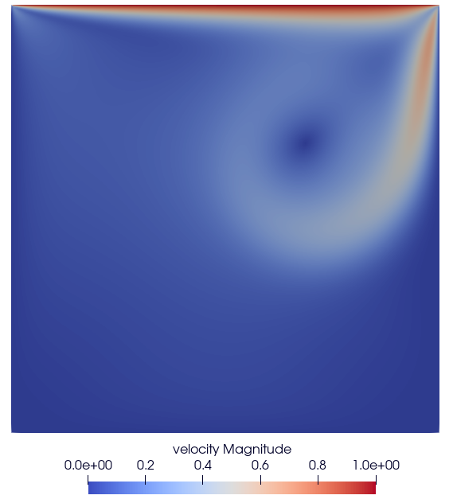
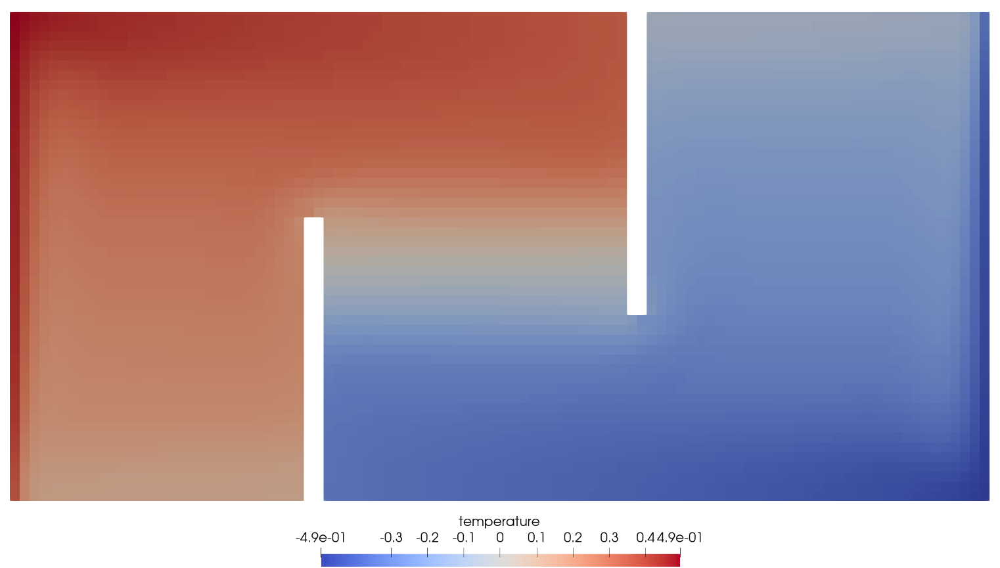
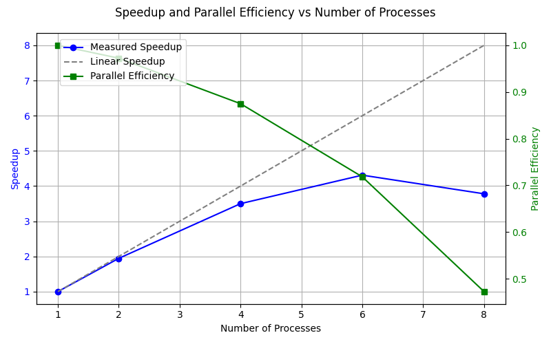
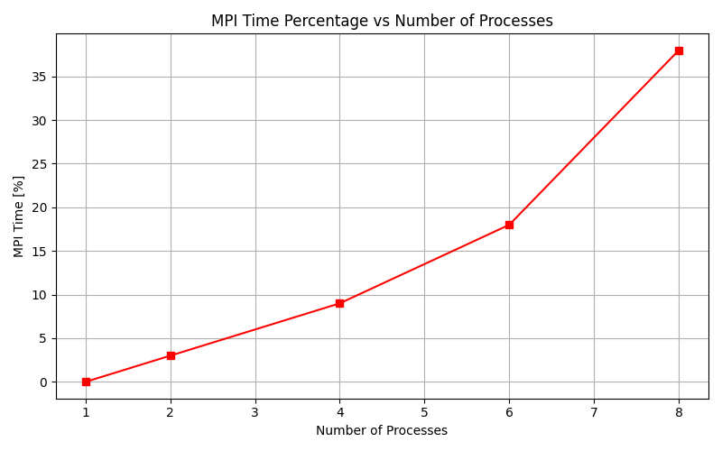
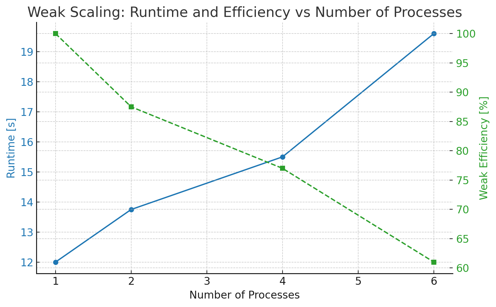
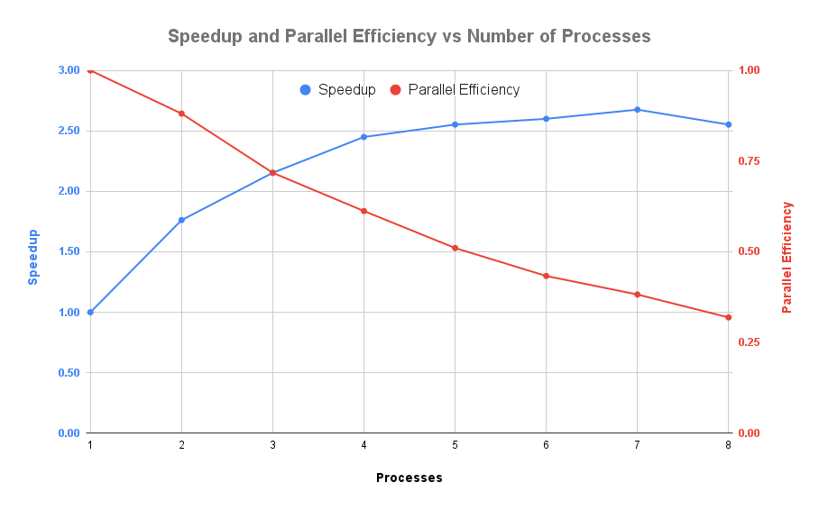

# CFD Lab - Worksheet 2

Authors: Jonas Schupp, Miguel Veganzones, Iñigo Ruiz

Date: June 17nd

Course: CFD Lab   

---

## Table of Contents

1. [Introduction](#introduction)
1. [Validation](#validation)
    1. [Lid Driven Cavity](#lid-driven-cavity)
    2. [Fluid Trap](#fluid-trap)
3. [Performance Analysis](#performance-analysis)
    1. [Lid Driven Cavity](#lid-driven-cavity-performance)
    2. [Rayleigh Benard](#rayleigh-benard-performance)

## Introduction

This worksheet introduces support for parallel execution of simulations with
MPI.
Parallelization is achieved by splitting the simulation domain into regions,
processing them independently and communicating boundary information frequently
across these regions.

In the following sections, we validate the parallel implementation by comparing its results to those obtained in sequential execution and analyze its performance with respect to speedup and parallel scalability.

## Validation
To validate our MPI-based parallelization, we run two example simulations using various domain decompositions, including sequential execution. For each configuration, we compare the simulation output and expect quantitatively consistent results across all decompositions with respect to the key quantities of interest: pressure, velocity, and temperature.

For reference, we will record the total number of SOR iterations in each run as a simple metric for comparison, although we do not expect an exact match here.
The SOR solver we use, which is a modified version of Gauss Seidel, is a inherently sequential solver, as it updates the pressure values in place and new pressure values depend on the partially updated neighbouring pressure values.
The algorithm needs some modification to be adapted for parallel execution, this new version will be referred to as block SOR.
At each step, each region performs a regular SOR iteration and then updated boundary values between them are exchanged across regions.
Since now we only communicate the pressure padding cell values after each full SOR iteration, the padding cells for each part of the decomposed domain do not get updated directly.
This means that the block SOR solver effectively uses non-updated values for the padding cells that would have been updated already in the sequential execution.
That is the reason why we expect minor differences in the total number of SOR iteration.

### Lid Driven Cavity
For the Lid Driven Cavity we use `imax = jmax = 300` for the number of cells and we set `x_lenght = y_lenght = 10` to complete the simulations in a reasonable time.
For the domain we use three different decompositions ad compare it to the fully sequential one (`iproc = jpoc = 1`):

|  |  |  |
|:--:|:--:|:--:|
| *iproc = 1, jproc = 4* | *iproc = 2, jproc = 2* | *iproc = 3, jproc = 2* |

For all domain decompositions we obtain the exact same result:

*Figure: velocity for Lid Driven Cavity - all decompositions show this result*

For the number of SOR iterations, we observe slight differences which can be attributed to different block SOR domains as explained above in [Validation](#validation)
| iproc | jproc | SOR Iterations |
|:-----:|:-----:|:---------------:|
|   1   |   1   |     45428       |
|   1   |   4   |     46050       |
|   2   |   2   |     45419       |
|   3   |   2   |     45571       |

### Fluid Trap
For the Fluid Trap domain we use two different decompositions and compare them to the fully sequential one (`iproc = jpoc = 1`):

|  |  |
|:--:|:--:|
| *iproc = 2, jproc = 3* | *iproc = 3, jproc = 2* |

For all domain decompositions we obtain the exact same result:

*Figure: Temperature for Fluid Trap - all decompositions show this result*

For the number of SOR iterations we again observe slight differences, attributed to the different block SOR domains in each example.

| iproc | jproc | SOR Iterations |
|:-----:|:-----:|:---------------:|
|   1   |   1   |      13657      |
|   2   |   3   |      12808      |
|   3   |   2   |      12983      |

## Performance Analysis
In the following we present a performance analysis for the Lid Driven Cavity and the Rayleigh Benard example. In general, we temporarily switch off the vtk output and the terminal prints to fully focus on the computations and reduce the sequential part as much as possible.  
### Lid Driven Cavity Performance
For the lid-driven cavity, we examine both strong and weak scaling to analyze the performance of our parallel CFD solver as a function of the number of processors.
#### Strong Scaling
To start with the strong scaling, we are running the Lid Driven cavity for `imax = jmax = 300` and `x_length = y_length = 10` for different combinations of `iproc` and `jproc`.
To compute the speedup, we use the standard definition:
$$
S(p) = \frac{T(1)}{T(p)}
$$
where $T(1)$ is the runtime with 1 processor and $T(p)$ is the runtime with $p$ processor for the same problem size. The parallel efficiency is then defined as
$$
E(p) = \frac{S(p)}{p}
$$

We measure the following runtimes and compute the corresponding speedups:

| iproc | jproc | Total Procs | Runtime [s] | Speedup | Efificiency |
|:-----:|:-----:|:-----------:|:-----------:|:-------:|:-------:|
|   1   |   1   |      1      |    56.0     |   -     |   -    |
|   1   |   2   |      2      |    29.0     |   1.93  |   97%  |
|   2   |   1   |      2      |    28.5     |   1.96  |   98%  |
|   2   |   2   |      4      |    16.0     |   3.50  |   88%  |
|   3   |   2   |      6      |    13.0     |   4.31  |   72%  |
|   4   |   2   |      8      |    14.8     |   3.78  |   47%  |

*Figure: Speedup  and Parallel Efficiency vs. Number of Processors*

We observe nearly linear speedup for a small number of processors. As the number of processor increases further, the speedup curve begins to flatten and eventually drops slightly, with 8 processors performing worse than 6. This drop is explained by the growing communication overhead: with more subdomains, the surface-to-volume ratio per processor increases, resulting in a larger proportion of ghost-cell communication relative to computation. This makes further parallelization less efficient beyond a certain point.
The parallel efficiency reflects this trend clearly, decreasing as more processors are added.
To investigate this further, we profiled the simulation using the mpiP profiler. The results confirmed that the percentage of time spent inside MPI calls increases with the number of processors, indicating rising communication costs.

*Figure: % of MPI time vs. number of processors -  Measured with mpiP*

#### Weak Scaling
In weak scaling, we take a different approach: the problem size increases proportionally with the number of processors, such that the work per processor remains constant.
When increasing the resolution (`imax and jmax`) we also need to increase the physical domain (`x_length and y_length`) accordingly to ensure that dx and dy stay constant, as they influnce the simulation , for example in the timestepping.
The weak efficiency is computed as:
$$
E_{weak}(p) = \frac{T(1)}{T(p)}
$$
where $T(p)$  is the runtime for a domain p-times larger, run on p processors, such that the load per processor stays the same.

We measure the following results:
| iproc | jproc | imax/jmax  |  xlength/ylength | Total Procs | Runtime [s] |  Weak Efficiency [%] |
|:-----:|:-----:|:----------:|:----------------:|:-----------:|:-----------:|:--------------------:|
|   1   |   1   |    100     |       2.00       |      1      |    12.0     |           -          |
|   1   |   2   |    141     |       2.83       |      2      |    13.8     |          87          |
|   2   |   1   |    141     |       2.83       |      2      |    13.7     |          88          |
|   2   |   2   |    200     |       4.00       |      4      |    15.5     |          77          |
|   3   |   2   |    245     |       4.90       |      6      |    19.6     |          61          |

We observe that runtime increases with the number of processors, resulting in a decline in weak scaling efficiency. This is expected, as each additional processor increases the communication complexity of the simulation. Although the workload per rank remains constant, the number of MPI neighbors and boundary interfaces increases, introducing delays from ghost-layer exchanges for example.

*Figure: Runtime and weak efficiency vs. number of processors*

### Rayleigh Benard Performance

#### Strong scaling

For the strong scaling we simulate the problem multiple times increasing the number of processes.
In this case, since the layout is horizontal, we divided the domain by increasing only `iproc`.

We measure the following runtimes and compute the corresponding speedups:

| Processes | SOR Iterations | Runtime [s] | Speedup | Parallel Efficiency |
|-----------|----------------|-------------|---------|----------------------|
| 1         | 3,010,291      | 115.703     | 1.00    | 1.00                 |
| 2         | 2,859,516      | 65.6682     | 1.76    | 0.88                 |
| 3         | 2,893,026      | 53.7326     | 2.15    | 0.72                 |
| 4         | 2,714,206      | 47.2364     | 2.45    | 0.61                 |
| 5         | 2,741,880      | 45.3361     | 2.55    | 0.51                 |
| 6         | 2,712,989      | 44.5048     | 2.60    | 0.43                 |
| 7         | 2,719,609      | 43.2434     | 2.68    | 0.38                 |
| 8         | 2,709,138      | 45.3343     | 2.55    | 0.32                 |

*Figure: Speedup  and Parallel Efficiency vs. Number of Processes*

In this case, we observe that the speedup quickly approaches a maximum of approximately `2.5`, indicating that the parallel efficiency drops off rapidly as more processes are added.

It is also worth noting that simulating this example with different numbers of processes leads to slightly different results. While the typical qualitative behavior of Rayleigh-Bénard convection, such as the formation of convection cells, remains intact, the locations of the circular cells differ slightly between runs.
Initially, this surprised us, especially given that in the [Validation](#validation) section we had verified that parallelization yields consistent results. However, the Rayleigh-Bénard problem is known to be chaotic and highly sensitive to perturbations. Since our parallel solver uses a block SOR scheme, which introduces small differences between decompositions, we concluded that such deviations are to be expected.
In fact, we found that simply changing the maximum number of SOR iterations (without altering the domain decomposition) can already lead to visible changes in the result. This effect we did not observe in other test cases. This shows how sensitive the Rayleigh-Bénard system is to even minimal variations in numerical treatment or convergence behavior.

