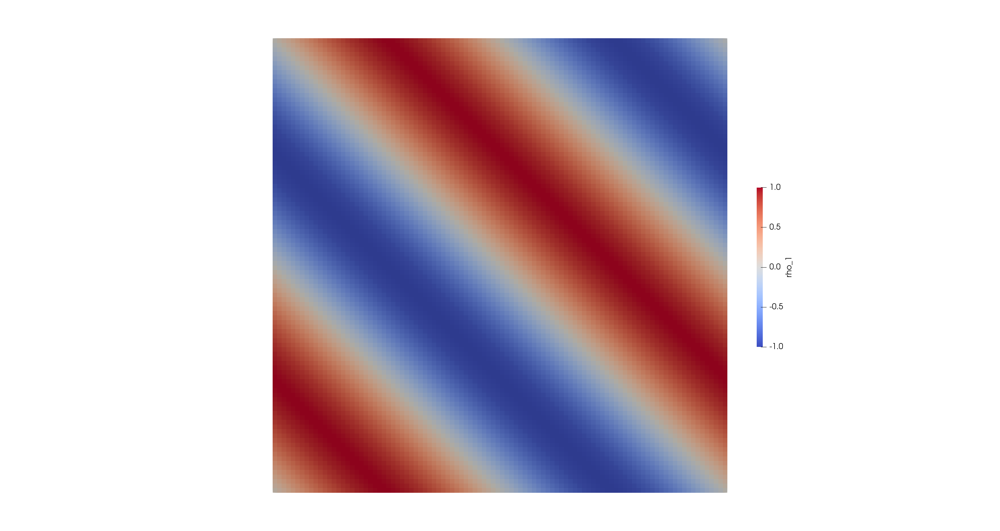
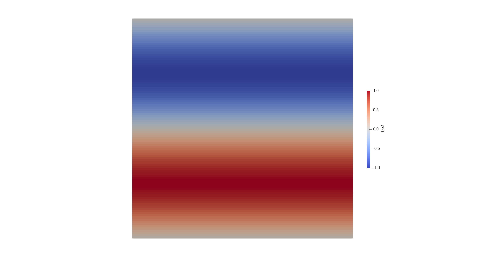

# Worksheet 1 - Low-order Schemes

## 1. Results Visualization

Results for different initial conditions $\quad \rho(x,y,t\in[0,1])$

Advection Velocity $\quad v = 1 \frac{m}{s}$

---

### 1.1 

$\rho_1(x,y, t=0) = \sin(2\pi(x + y))$

Analytic solution:

$\quad \begin{aligned}&\rho_1(x,y,t) = sin(2\pi(x+y-2vt)) \\ &\rho_1(x,y,t=1) = sin(2\pi(x+y) - 4\pi) = \rho_1(x,y, t=0)\end{aligned}$

  

---

### 1.2.

$\rho_1(x,y, t=0) = \sin(2\pi y)$

Analytic solution:

$\quad \begin{aligned}&\rho_1(x,y,t) = sin(2\pi (y - vt) \\ &\rho_1(x,y,t=1) = sin(2\pi y - 2\pi) = \rho_2(x,y, t=0)\end{aligned}$

  

---

### 1.3.

$\rho_1(x,y, t=0) = 1$

Analytic solution: $\quad \rho_3 = 1$

  

As expected, the solutions at $t=1$ coincide with the initial conditions. This is due to the periodic nature of the sine functions used, combined with the fact that the underlying advection equation transports the solution without distortion or decay, regardless of the numerical dissipation introduced by the low-order scheme used.

## 2. Convergence Analysis

Grid elements $\ N^* = 50 \quad (h^*_{x,y} = 2 \times10^{-2})$

<table style="display: inline-block;">
    <thead>
            <tr>
                <th>Var</th><th>L1</th><th>L2</th><th>L∞</th>
            </tr>
        </thead>
        <tbody>
            <tr>
                <td>ρ1</td><td>2.094454e-01</td><td>2.326760e-01</td><td>3.399823e-01</td>
            </tr>
            <tr>
                <td>ρ2</td><td>1.643870e-01</td><td>1.826254e-01</td><td>2.623238e-01</td>
            </tr>
            <tr>
                <td>ρ3</td><td>0.000000e+00</td><td>0.000000e+00</td><td>0.000000e+00</td>
            </tr>
        </tbody>
    </table>

Grid elements $\ N = 2N^* \quad (h_{x,y} = \frac{1}{2}h^*)$

<table style="display: inline-block;">
        <thead>
            <tr>
                <th>Var</th><th>L1</th><th>L2</th><th>L∞</th>
            </tr>
        </thead>
        <tbody>
            <tr>
                <td>ρ1</td><td>1.150024e-01</td><td>1.277450e-01</td><td>1.868521e-01</td>
            </tr>
            <tr>
                <td>ρ2</td><td>8.826154e-02</td><td>9.803794e-02</td><td>1.405615e-01</td>
            </tr>
            <tr>
                <td>ρ3</td><td>0.000000e+00</td><td>0.000000e+00</td><td>0.000000e+00</td>
            </tr>
        </tbody>
    </table>

Grid elements $\ N = 4N^* \quad (h_{x,y} = \frac{1}{4}h^*)$

<table style="display: inline-block;">
        <thead>
            <tr>
                <th>Var</th><th>L1</th><th>L2</th><th>L∞</th>
            </tr>
        </thead>
        <tbody>
            <tr>
                <td>ρ1</td><td>6.033247e-02</td><td>6.701614e-02</td><td>9.802876e-02</td>
            </tr>
            <tr>
                <td>ρ2</td><td>4.576052e-02</td><td>5.082944e-02</td><td>7.280521e-02</td>
            </tr>
            <tr>
                <td>ρ3</td><td>0.000000e+00</td><td>0.000000e+00</td><td>0.000000e+00</td>
            </tr>
        </tbody>
</table>

**Convergence Rate**

$r = \frac{log(err_{2h}/err_{h})}{log(2)}$

<table style="display: inline-block; border-collapse: collapse;" border="1" cellpadding="6" cellspacing="0">
    <thead>
        <tr>
            <th rowspan="2">h</th>
            <th rowspan="2">Var</th>
            <th colspan="3">Convergence Rate</th>
        </tr>
        <tr>
            <th>L1</th>
            <th>L2</th>
            <th>L∞</th>
        </tr>
    </thead>
    <tbody>
        <tr>
            <td rowspan="2">h*</td>
            <td>ρ1</td>
            <td>-</td><td>-</td><td>-</td>
        </tr>
        <tr>
            <td>ρ2</td>
            <td>-</td><td>-</td><td>-</td>
        </tr>
        <tr>
            <td rowspan="2">h = 1/2 h*</td>
            <td>ρ1</td>
            <td>0.867</td><td>0.866</td><td>0.863</td>
        </tr>
        <tr>
            <td>ρ2</td>
            <td>0.897</td><td>0.894</td><td>0.899</td>
        </tr>
        <tr>
            <td rowspan="2">h = 1/4 h*</td>
            <td>ρ1</td>
            <td>0.933</td><td>0.933</td><td>0.932</td>
        </tr>
        <tr>
            <td>ρ2</td>
            <td>0.949</td><td>0.946</td><td>0.949</td>
        </tr>
    </tbody>
</table>

Considerations:
- The analytical solution used in `get_initial_values` respects the periodic boundary conditions by leveraging the periodicity of the sine function, consistent with the domain $[0,1]^2$
- As expected, doubling the number of grid elements, thus halving the cell size, results in the error being reduced by approximately a factor of two. This indicates a **linear convergence rate** $(r \approx 1)$, which is consistent with the theoretical behavior of the first-order numerical scheme used
