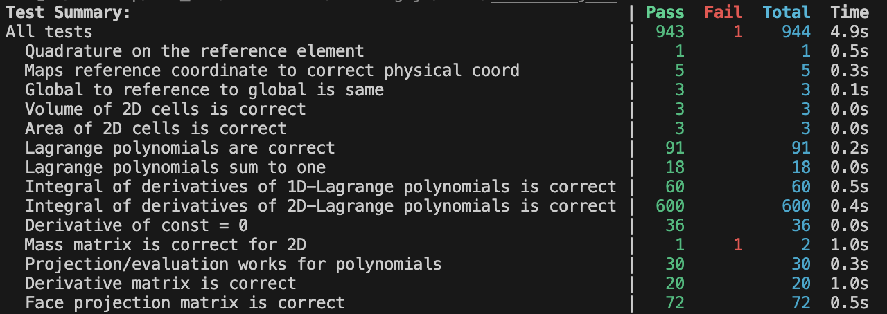
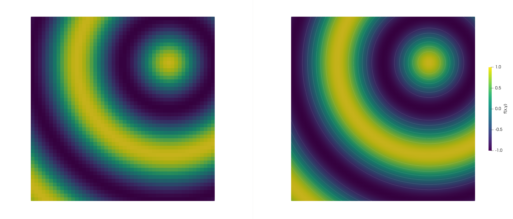

# Worksheet2 - Spatial Discretization

# Tests

  
  
Figure 1: tests table, the right massmatrix function was left commented-out to show the user the success of all tests (except the massmatrix)

# Sibson Function Convergence Analysis

The following tables present the error norms (L1, L2, and L∞) for the Sibson function at t = 0 for different orders and grid resolutions.

### Order 1 Error Norms

| Grid Elements | L1 Error | L2 Error | L∞ Error |
|---------------|----------|----------|----------|
| 25            | 7.625868e-02 | 1.009303e-01 | 3.298943e-01 |
| 50            | 3.821634e-02 | 5.055607e-02 | 1.655180e-01 |

### Order 3 Error Norms

| Grid Elements | L1 Error | L2 Error | L∞ Error |
|---------------|----------|----------|----------|
| 25            | 1.963029e-04 | 2.475913e-04 | 1.108314e-03 |
| 50            | 2.459064e-05 | 3.102046e-05 | 1.354458e-04 |

### Order 5 Error Norms

| Grid Elements | L1 Error | L2 Error | L∞ Error |
|---------------|----------|----------|----------|
| 25            |1.507168e-07  |  1.984687e-07  |  7.610262e-07|
| 50            |4.719674e-09  | 6.214056e-09  |  2.326693e-08|

## Convergence Rates

The convergence rate is calculated using the formula:

$$
\text{Convergence Rate} = \frac{\log\left(\frac{\text{e}_\text{f}}{\text{e}_\text{c}}\right)}{\log(2)}
$$

Where $e_{f}$ is the error on the finer grid and $e_{c}$ is the error on the coarser grid.

### Convergence Rates for Different Orders (Grid 25->50)

| Order | L1 Rate | L2 Rate | L∞ Rate |
|-------|---------|---------|---------|
| 1     | 0.9967  | 0.9974  | 0.9950  |
| 3     | 2.9969  | 2.9967  | 3.0326  |
| 5     | 4.9970  | 4.9972  | 5.0316  |

### Theoretical vs. Actual Order of Convergence

| Order | Expected Rate | L2 Rate |
|-------|---------------|---------|
| 1     | 1             | 0.9974  |
| 3     | 3             | 2.9967  |
| 5     | 5             | 4.9972  |

  
  
Figure 2: Comparison of the Sibson function at t=0, using different interpolation orders: first-order (left) and second-order (right), both computed on a grid with N=50 cells.

## Analysis

The convergence analysis shows that the actual convergence rates closely match the theoretical expected rates for all orders of approximation. For Order 1, the L2 convergence rate is 0.9974, for Order 3 it is 2.9967, and for Order 5 it is 4.9972. Higher-order methods achieve lower error levels even on coarser grids, with Order 5 showing approximately 4 orders of magnitude lower error than Order 1 on the same grid. The convergence rate increases with the order of the method, resulting in much larger error reduction for higher-order methods with each grid refinement.

