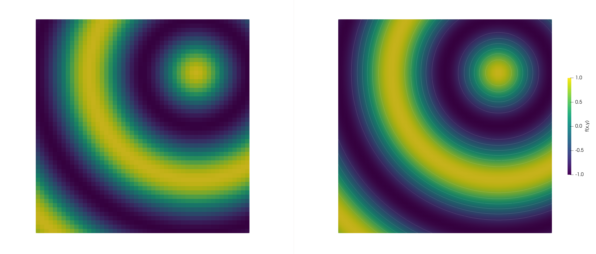

# Worksheet2 - Spatial Discretization

## Sibson Function

<!-- 

<table style="display: inline-block; border-collapse: collapse;" border="1" cellpadding="6" cellspacing="0">
    <thead>
        <tr>
            <th rowspan="2">h</th>
            <th rowspan="2">Order</th>
            <th colspan="3">Error</th>
            <th colspan="3">Convergence Rate</th>
        </tr>
        <tr>
            <th>L1</th>
            <th>L2</th>
            <th>L∞</th>
            <th>L1</th>
            <th>L2</th>
            <th>L∞</th>
        </tr>
    </thead>
    <tbody>
        <tr>
            <td rowspan="3">h*</td>
            <td rowspan="1">1</td>
            <td>3.821634e-02</td><td>5.055607e-02</td><td>1.655180e-01</td><td>-</td><td>-</td><td>-</td><td>-</td>
        </tr>

        <tr>
            <td rowspan="3">h = 1/2 h*</td>
            <td>-</td><td>-</td><td>-</td><td>-</td><td>-</td><td>-</td><td>-</td>
        </tr>
        <tr>
            <td rowspan="3">h = 1/4 h*</td>
            <td>-</td><td>-</td><td>-</td><td>-</td><td>-</td><td>-</td><td>-</td>
        </tr>
    </tbody>
</table>

 -->

order 1 (50, 100, 200)

3.821634e-02    5.055607e-02    1.655180e-01
1.911756e-02    2.528937e-02    8.282644e-02
9.559802e-03    1.264610e-02    4.142555e-02

order 2 (50, 100, 200)

1.201972e-03    1.551360e-03    8.440019e-03
3.005984e-04    3.879924e-04    2.114648e-03
7.515480e-05    9.700765e-05    5.290465e-04

order 3 (50, 100, 200)

2.459064e-05    3.102046e-05    1.354458e-04
3.075956e-06    3.879786e-06    1.675382e-05
3.845310e-07    4.850429e-07    2.082955e-06

  
  
Figure 1: Comparison of the Sibson function at t=0, using different interpolation orders: first-order (left) and second-order (right), both computed on a grid with N=50 cells.

