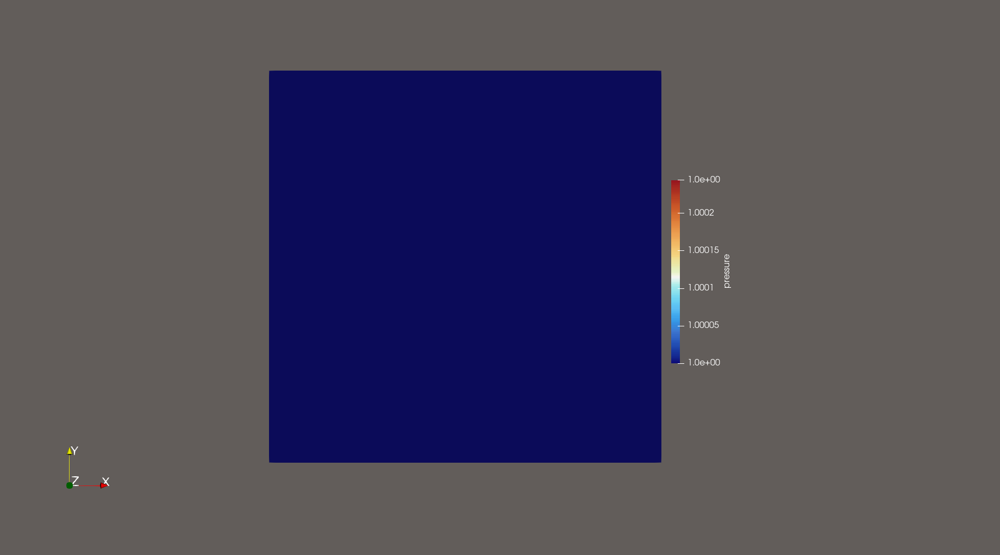
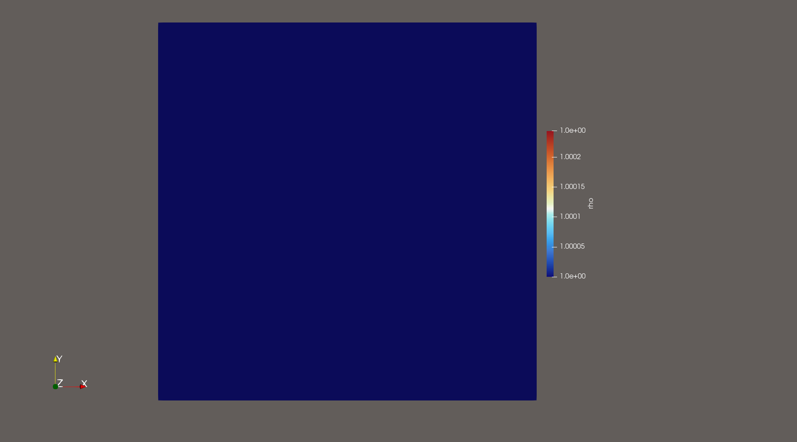
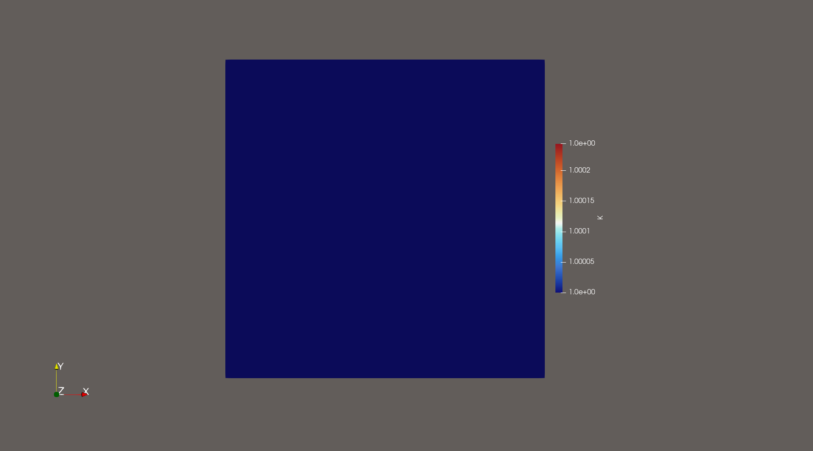

# Worksheet3 - High-order Scheme

## 4.1. Derivative Matrix Unit Test

The derivative matrix implementation was validated through unit tests, confirming correctness and alignment with theoretical expectations.

**Test Summary:**

```
Test Summary: | Pass  Total   Time
All tests     |  944    944  10.1s
```
All tests pass, including the derivative matrix test. This confirms correctness and stability of the derivative matrix implementation within the current numerical setup.

## 4.2. Constant State Preservation

To verify the scheme’s robustness, a constant initial state \( Q = (v_x=0, v_y=0, #p=1, \rho_0=1, K_0=1) \) was tested. The full state vector Q remained unchanged throughout the simulation, confirming that the numerical method exactly preserves constant solutions.

This behavior validates consistency and stability of the scheme.

Plots below further illustrate the preservation across all variables.

# Results:

###!!!!! The plot for u and v show oscillations!!!!


<div style="text-align: center;">
  
  <p style="margin-top: 8px; font-style: italic;">Figure 3: Constant pressure preserved, confirming stability of the scheme for trivial solutions.</p>
</div>

<div style="text-align: center;">
  
  <p style="margin-top: 8px; font-style: italic;">Figure 2: No deviation from the initial value, demonstrating proper handling of material parameters.</p>
</div>

<div style="text-align: center;">
  
  <p style="margin-top: 8px; font-style: italic;">Figure 1: Bulk modulus (\(K_0\)) remains constant over time, validating the zero-flux implementation for material parameters.</p>
</div>

## 4.3. Advection Scenario: Error Analysis

Errors were computed for the advection equation across orders 1–4:

| Order | Variable | L1       | L2       | L∞       |
| ----- | -------- | -------- | -------- | -------- |
| 1     | ρ₁       | 1.15e-01 | 1.28e-01 | 1.87e-01 |
|       | ρ₂       | 8.83e-02 | 9.80e-02 | 1.41e-01 |
|       | ρ₃       | 0.00e+00 | 0.00e+00 | 0.00e+00 |
| 2     | ρ₁       | 5.85e+06 | 8.15e+06 | 5.89e+07 |
|       | ρ₂       | 1.27e-02 | 1.41e-02 | 2.05e-02 |
|       | ρ₃       | 2.46e-16 | 2.82e-16 | 4.44e-16 |
| 3     | ρ₁       | 1.24e+37 | 1.71e+37 | 1.72e+38 |
|       | ρ₂       | 2.68e+03 | 3.71e+03 | 3.33e+04 |
|       | ρ₃       | 4.92e-16 | 5.17e-16 | 8.88e-16 |
| 4     | ρ₁       | 1.02e+58 | 1.35e+58 | 1.08e+59 |
|       | ρ₂       | 6.71e+55 | 8.72e+55 | 5.65e+56 |
|       | ρ₃       | 2.05e+54 | 2.40e+54 | 6.31e+54 |

For first-order discretization, errors are moderate and consistent. However, from second order onwards, instability appears: while ρ₂ and ρ₃ maintain small or negligible errors, ρ₁ exhibits large and rapidly growing errors, increasing by many orders of magnitude at higher orders. This suggests numerical instability or poor conditioning for ρ₁ at higher polynomial degrees.

## 4.4 Acoustic Scenario: Performance Across Orders

Errors were computed for the acoustic wave equation across orders 1–4:

| Order | Variable | L1       | L2       | L∞       |
| ----- | -------- | -------- | -------- | -------- |
| 1     | u        | 3.20e-02 | 4.19e-02 | 1.43e-01 |
|       | v        | 2.18e-02 | 2.69e-02 | 6.78e-02 |
|       | pressure | 5.36e-02 | 1.15e-01 | 9.07e-01 |
|       | ρ        | 0.00e+00 | 0.00e+00 | 0.00e+00 |
|       | K        | 0.00e+00 | 0.00e+00 | 0.00e+00 |
| 2     | u        | 8.23e-02 | 1.28e-01 | 5.82e-01 |
|       | v        | 5.59e-02 | 8.38e-02 | 2.86e-01 |
|       | pressure | 8.47e-02 | 1.29e-01 | 8.02e-01 |
|       | ρ        | 2.46e-16 | 2.82e-16 | 4.44e-16 |
|       | K        | 1.42e-16 | 2.02e-16 | 4.44e-16 |
| 3     | u        | 8.56e-02 | 1.36e-01 | 5.72e-01 |
|       | v        | 5.79e-02 | 8.69e-02 | 3.00e-01 |
|       | pressure | 8.65e-02 | 1.31e-01 | 8.15e-01 |
|       | ρ        | 2.60e-16 | 3.06e-16 | 6.66e-16 |
|       | K        | 1.49e-16 | 2.19e-16 | 6.66e-16 |
| 4     | u        | 8.59e-02 | 1.37e-01 | 5.51e-01 |
|       | v        | 5.79e-02 | 8.71e-02 | 3.02e-01 |
|       | pressure | 8.66e-02 | 1.31e-01 | 8.17e-01 |
|       | ρ        | 1.99e-16 | 2.68e-16 | 6.66e-16 |
|       | K        | 1.20e-16 | 1.93e-16 | 6.66e-16 |

---

Higher-order schemes (orders 2–4) show similar error magnitudes for velocity, pressure, and auxiliary variables, with only minor improvements. The first-order scheme, while less accurate, is significantly more stable and free of spurious high-frequency noise. All orders maintain near-zero errors for conserved quantities like ρ and K, confirming good conservation behavior.