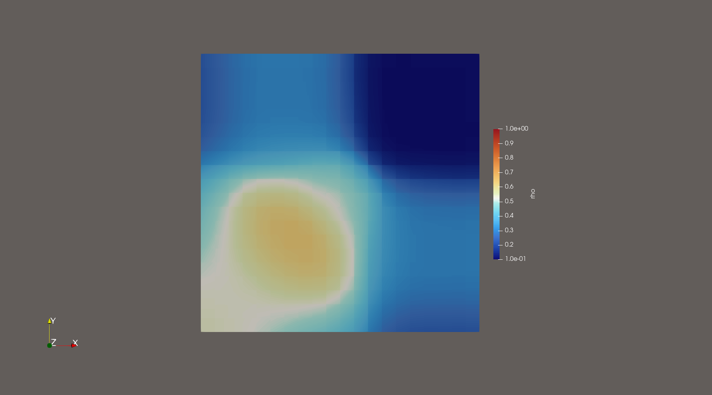
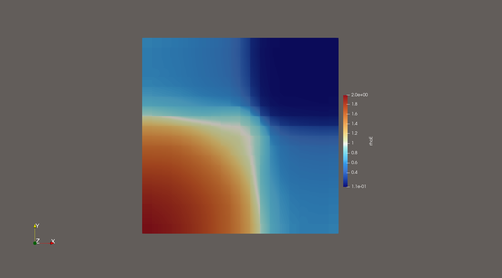
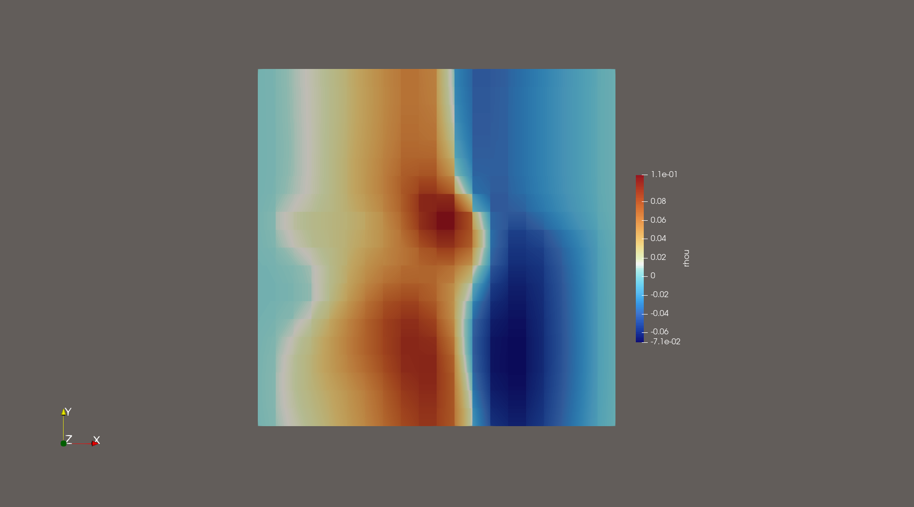
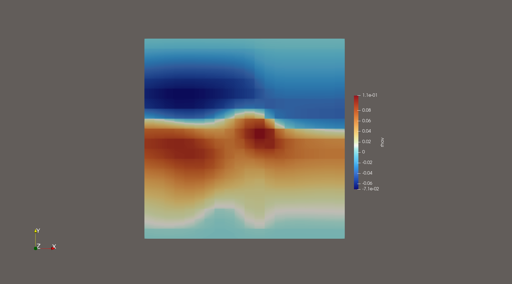

# Worksheet4 - Non-linear Equations

## 3.1. Gaussian Wave Validation

The Euler equations implementation was tested with a smooth Gaussian wave, showing proper behavior. Velocity components (rhou, rhov) maintained small errors (~1e-2), confirming correct momentum transport. Density (rho) and energy (rhoE) showed larger but expected errors due to nonlinear effects, while remaining stable throughout the simulation.

Var     L1          L2          L∞
rhou    3.75e-02    4.54e-02    1.08e-01
rhov    3.75e-02    4.54e-02    1.08e-01 
rho     4.23e-01    5.02e-01    9.00e-01
rhoE    1.14e+00    1.39e+00    2.39e+00

  
  
Figure 1: Constant pressure preserved, confirming stability of the scheme for trivial solutions.

  
  
Figure 2: Constant pressure preserved, confirming stability of the scheme for trivial solutions.

  
  
Figure 3: Constant pressure preserved, confirming stability of the scheme for trivial solutions.

  
  
Figure 4: Constant pressure preserved, confirming stability of the scheme for trivial solutions.

These results confirm the implementation correctly handles smooth solutions, with error magnitudes matching theoretical expectations for this scheme order. The preserved wave profile and stable evolution demonstrate proper functionality for smooth initial conditions.