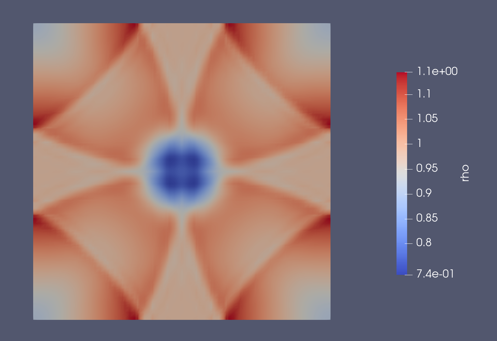
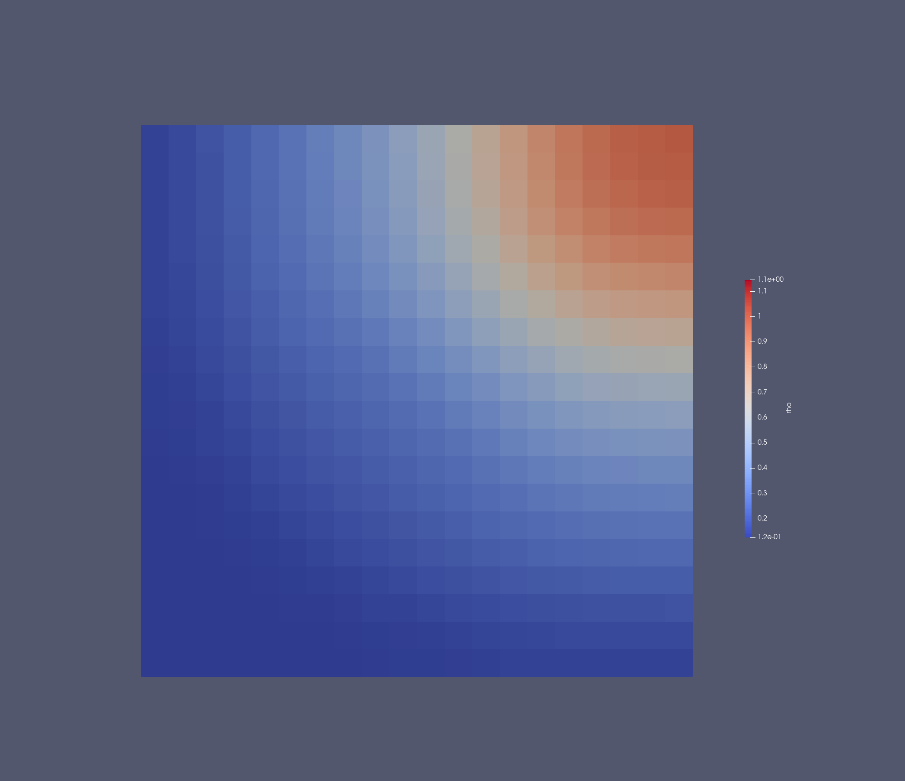
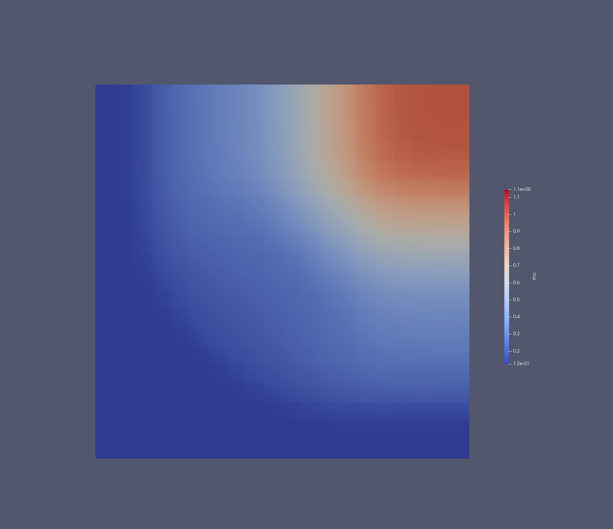

# Worksheet4 - Non-linear Equations

## 3.1. Gaussian Wave Validation

The Euler equations implementation was tested with a smooth Gaussian wave, showing proper behavior. 

  
  
Figure 1.1: euler equation using gaussian wave

As you can see the solution is symmetric as expected and doesn't blow up. 

## 3.2 Shock tube

The order 1 runs without encountering any problems, the order 4 uses the limiter and delivers a smoother solution than order 1 as expected.

  
  
Figure 2.1: Shock tube order1 

  
  
Figure 2.2: Shock tube order4

These results confirm the implementation correctly handles both shocks and smooth initial conditions.

## Shock tube video
This is the video about the shock tube simulation with 20 elements and an order 3.
<video width="800" controls>
  <source src="https://gitlab.lrz.de/riccardo.capellupo/terradg.jl/-/raw/worksheet4/docs/assignments/shocktube.mp4" type="video/mp4">
</video>

